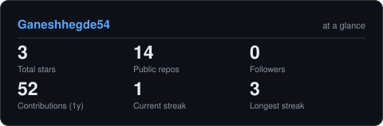
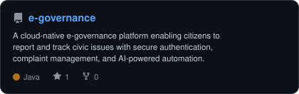
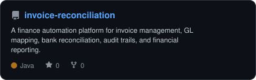
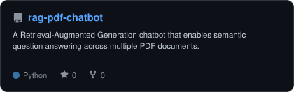
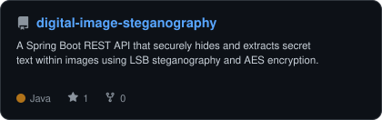

<div align="center">

<!-- PORTRAIT PLACEHOLDER
     If you want to add a portrait:
     1. Drop your photo as assets/me.png (or me.jpg)
     2. Run: python scripts/dotify.py assets/me.png -o assets/portrait --cols 100 --equalize --detail 0.5 --color --circle
     3. Uncomment the line below to show it:

-->

<br>

<!-- NAME / TAGLINE - animated typing -->
<a href="https://github.com/Ganeshhegde54">
  
</a>

<br>

<!-- SOCIALS -->
<a href="https://github.com/Ganeshhede54"></a>
<a href="mailto:ganeshhegde2005@gmail.com"></a>
<a href="https://linkedin.com/in/YOUR_LINKEDIN_USERNAME"></a>

<br><br>


</div>

---

## `~/` whoami

```console
$ cat about.txt
```

Hi, I'm **Ganesh Mahabaleshwar Hegde**, a Computer Science and Engineering student at **Sai Vidya Institute of Technology** (Bengaluru, Karnataka) graduating in 2027. I am a backend developer building microservices, REST APIs, and AI-powered applications. I specialize in designing structured, maintainable backend codebases using Java, Spring Boot, and PostgreSQL, and incorporating vector search databases and retrieval systems for LLM pipelines.

- 🎓 **Education**: B.E. in Computer Science and Engineering (2023 - 2027) | **CGPA: 8.57 / 10**
- 🛠️ **Current Focus**: Architecting clean, event-driven REST APIs and refining system design and data structures.
- 🚀 **Goals**: Looking for entry-level Software Developer / Backend Developer opportunities where I can work on production systems.
- 💡 **Philosophy**: Write clear, self-documenting code and prioritize clean application architecture.

<br>

<div align="center">

### `~/` toolbox


</div>

---

<div align="center">

## `~/` skill radar

<table>
<tr>
<td width="50%" align="center" valign="middle">

<!-- Self-rated radar - edit assets/skills.json, the workflow redraws it -->
<picture>
  <source media="(prefers-color-scheme: dark)"  srcset="assets/radar-dark.svg">
  <source media="(prefers-color-scheme: light)" srcset="assets/radar-light.svg">
  
</picture>

</td>
<td width="50%" align="center" valign="middle">

<!-- Live radar built from real language byte counts across your repos -->
<picture>
  <source media="(prefers-color-scheme: dark)"  srcset="assets/radar-langs-dark.svg">
  <source media="(prefers-color-scheme: light)" srcset="assets/radar-langs-light.svg">
  
</picture>

</td>
</tr>
</table>

</div>

---

<div align="center">

## `~/` contribution calendar

<!-- 3D isometric calendar, regenerated every 6h by .github/workflows/metrics.yml -->


<br><br>

<!-- Snake eats the contribution graph - .github/workflows/snake.yml -->
<picture>
  <source media="(prefers-color-scheme: dark)"  srcset="https://raw.githubusercontent.com/Ganeshhegde54/Ganeshhegde54/output/snake-dark.svg">
  <source media="(prefers-color-scheme: light)" srcset="https://raw.githubusercontent.com/Ganeshhegde54/Ganeshhegde54/output/snake.svg">
  
</picture>

</div>

---

<div align="center">

## `~/` the numbers

<!-- Generated by scripts/cards.py into this repo. Deliberately NOT
     github-readme-stats / streak-stats / github-profile-trophy: those are
     shared public instances that go down and take the whole section with them. -->
<picture>
  <source media="(prefers-color-scheme: dark)"  srcset="assets/card-stats-dark.svg">
  <source media="(prefers-color-scheme: light)" srcset="assets/card-stats-light.svg">
  
</picture>

<br>


<br><br>


</div>

---

<div align="center">

## `~/` selected work

<!-- Cards generated by scripts/cards.py from assets/projects.json.
     Stars, forks and language are pulled live from the API on every run. -->
<table>
<tr>
<td width="50%">
  <a href="https://github.com/Ganeshhegde54/e-governance">
    <picture>
      <source media="(prefers-color-scheme: dark)"  srcset="assets/card-e-governance-dark.svg">
      <source media="(prefers-color-scheme: light)" srcset="assets/card-e-governance-light.svg">
      
    </picture>
  </a>
</td>
<td width="50%">
  <a href="https://github.com/Ganeshhegde54/invoice-reconciliation">
    <picture>
      <source media="(prefers-color-scheme: dark)"  srcset="assets/card-invoice-reconciliation-dark.svg">
      <source media="(prefers-color-scheme: light)" srcset="assets/card-invoice-reconciliation-light.svg">
      
    </picture>
  </a>
</td>
</tr>
<tr>
<td width="50%">
  <a href="https://github.com/Ganeshhegde54/rag-pdf-chatbot">
    <picture>
      <source media="(prefers-color-scheme: dark)"  srcset="assets/card-rag-pdf-chatbot-dark.svg">
      <source media="(prefers-color-scheme: light)" srcset="assets/card-rag-pdf-chatbot-light.svg">
      
    </picture>
  </a>
</td>
<td width="50%">
  <a href="https://github.com/Ganeshhegde54/digital-image-steganography">
    <picture>
      <source media="(prefers-color-scheme: dark)"  srcset="assets/card-digital-image-steganography-dark.svg">
      <source media="(prefers-color-scheme: light)" srcset="assets/card-digital-image-steganography-light.svg">
      
    </picture>
  </a>
</td>
</tr>
</table>

<sub>

| Project | Main Stack | Repository | Demo |
| :--- | :--- | :--- | :--- |
| **E-Governance Platform** | `Java` `Spring Boot` `Kafka` `Docker` | [Ganeshhegde54/e-governance](https://github.com/Ganeshhegde54/e-governance) | - |
| **AI Invoice Processing** | `Java` `Spring Boot` `React` `MySQL` | [Ganeshhegde54/invoice-reconciliation](https://github.com/Ganeshhegde54/invoice-reconciliation) | - |
| **Multi-Doc RAG Chatbot** | `Python` `LlamaIndex` `ChromaDB` `Gemini` | [Ganeshhegde54/rag-pdf-chatbot](https://github.com/Ganeshhegde54/rag-pdf-chatbot) | - |
| **Digital Steganography** | `Java` `Spring Boot` `REST API` `AES` | [Ganeshhegde54/digital-image-steganography](https://github.com/Ganeshhegde54/digital-image-steganography) | - |

</sub>

</div>

---

## `~/` exploring

Currently learning and expanding skills in:
- **Advanced Backend Architecture**: REST APIs, microservices communication patterns, system design, API gateways.
- **Event-Driven Systems**: Distributed logging and messaging with Apache Kafka.
- **DevOps & Containers**: Service containerization with Docker and cluster orchestration in Kubernetes.
- **Applied Artificial Intelligence**: RAG (Retrieval-Augmented Generation) application building, LLM context enhancement, and semantic searches with vector databases.

---

<div align="center">

<sub>`01110100 01101000 01100001 01101110 01101011 01110011 00100000 01100110 01101111 01110010 00100000 01110011 01100011 01110010 01101111 01101100 01101100 01101001 01101110 01100111`</sub>

</div>
